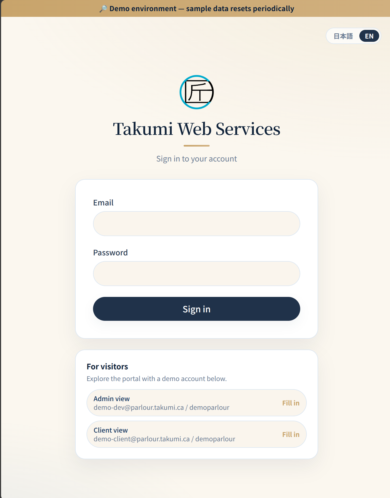
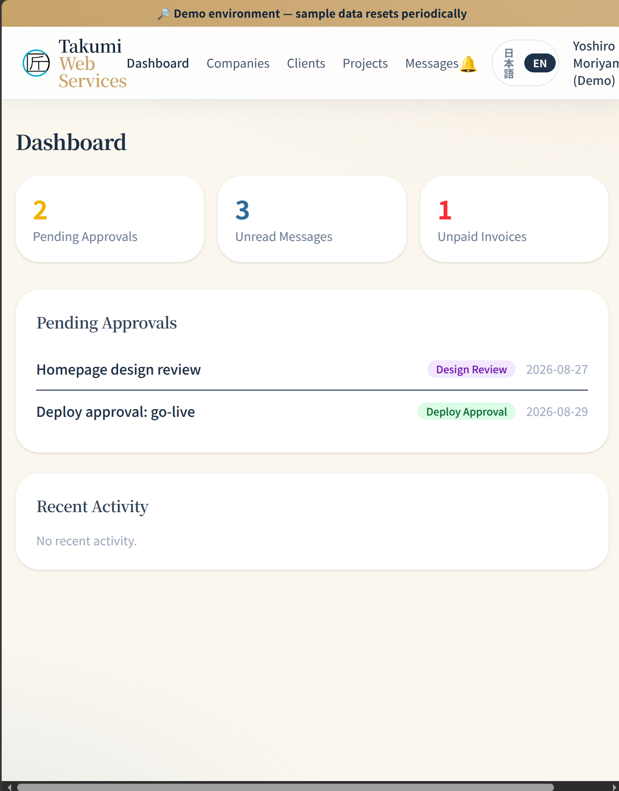
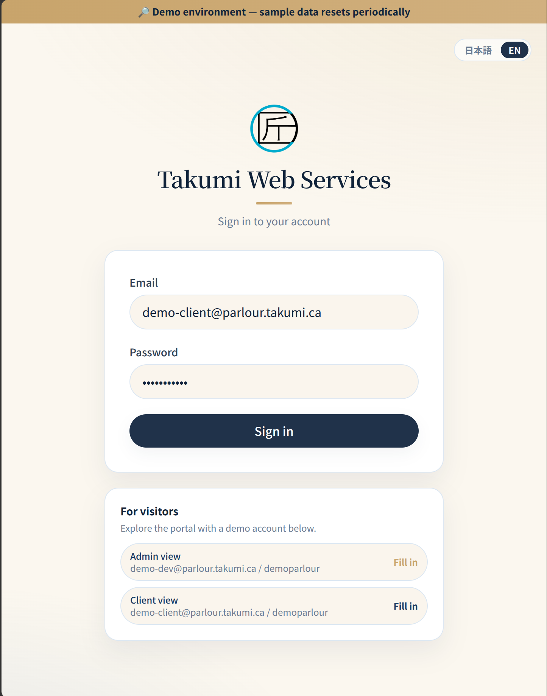

# Parlour

> **A client portal for freelance web developers: approvals, messages, and invoices in one place.**

[](https://github.com/moriyama-dev/parlour/actions/workflows/ci.yml)


🔗 **Live (production):** [parlour.takumi.ca](https://parlour.takumi.ca/) · 🎭 **Try the demo:** [demo-customer-portal.takumi.ca](https://demo-customer-portal.takumi.ca/login)

This repository is the actual source of the running application. Only secrets (credentials, keys) and
real client data are excluded — the database schema, API, and business logic are all here.

---

## Try it in two minutes

The demo runs the same code as production, with fake data instead of real clients.

**→ [demo-customer-portal.takumi.ca/login](https://demo-customer-portal.takumi.ca/login)**

You don't need to type anything. The login screen shows two demo accounts, each with a button that
fills in the credentials for you:

| Account | What you see |
| --- | --- |
| **Admin view** | The developer side: companies, clients, projects, task creation, invoicing |
| **Client view** | The client side: pending approvals, messages, invoices for their own company |

Sign in as one, look around, sign out, and try the other to see the same project from both sides.
The demo database resets to a clean state every night, so feel free to change things.

<!-- screenshot: login screen showing the two one-click demo accounts -->


---

## What it does

Parlour is built around one job: the back-and-forth between a freelance developer and a client
during a project. A developer sets up companies and projects, invites clients, and asks for the
sign-offs that dev work actually needs — "is this design okay to build?", "does the staging site
look right?", "can I deploy?". The client approves or rejects with a reason, sees invoices, and
messages the developer, all in one place instead of scattered email threads.

### Features (working today)

- **Token auth** with Laravel Sanctum — SPA login, multiple devices, tokens revoked on logout.
- **Two roles, kept apart** — `developer` and `client`. Each sees a different set of screens, and
  the API enforces the split independently of what the UI shows.
- **Companies & clients** — a developer manages companies and their contacts (a many-to-many
  model with a designated primary contact per company).
- **Invitations** — a developer invites a client by generating a link; the client opens it, sets a
  password, and their account is created. (The link is handed over directly; see Roadmap for email.)
- **Projects** — created by the developer; a client only ever sees projects belonging to their own
  company.
- **Task approval workflow** — tasks carry a type that matches real dev work (design review,
  staging review, deploy approval, dependency update). A client approves or rejects; rejecting
  requires a reason.
- **Append-only approval log** — every decision is written as a new immutable row. A later decision
  never overwrites an earlier one, so months later there is a clear record of what was signed off.
- **Messages** — per-project threads (with replies) between developer and client.
- **Invoices** — line items, tax, and a status (draft → sent → paid).
- **In-app notifications** — a feed with read / mark-all-read, for events like a task waiting on the
  client.
- **Bilingual UI (Japanese / English)** — the language follows the browser, and can be switched by
  hand at any time.

<!-- screenshot: developer dashboard (tasks awaiting client action, projects) -->


<!-- screenshot: client approval screen (approve / reject with reason) -->


---

## Architecture

Parlour is two separate apps that talk over HTTP:

- **`api/` — Laravel 13, JSON API only.** No Blade views for the app itself; it returns data.
- **`web/` — Vue 3 single-page app.** It holds all the screens and calls the API.

Keeping them apart means the frontend and backend can be reasoned about, tested, and deployed on
their own, and the same API could later serve a second client (a mobile app, say) without change.

**Authentication.** The SPA logs in against the API and receives a **Sanctum** token, which it
sends on every later request. Logout revokes the token server-side.

**Authorization is two independent checks, both server-side and both tested:**

- **Role** (`role:developer`) — who may manage companies, clients, and invitations.
- **Tenancy** (`project.access`) — *which* projects a given client may touch at all. Every route
  under `/projects/{project}` is guarded, and nested route bindings are scoped, so a `{task}` or
  `{invoice}` id from another company's project resolves to a 404 instead of being acted on.

Role alone is not enough: it would let any signed-in client reach another company's project by
guessing an id. The SPA hides those screens from clients, but hiding a link is not authorization —
the API checks it regardless.

**Approval workflow and the append-only log.** When a client approves or rejects a task, the
decision is stored as a new row in the approval log. Those rows are never updated or deleted. This
is the one place where "just overwrite the status" would have been easier but wrong: the history is
exactly what a developer and client point at later when they disagree about what was agreed, so it
is kept whole and is covered by tests.

---

## One codebase, two deployments

Production and the demo run the **same build**. The only differences are configuration and data,
controlled by a single `DEMO_MODE` flag:

| | Production (`parlour.takumi.ca`) | Demo (`demo-customer-portal.takumi.ca`) |
| --- | --- | --- |
| `DEMO_MODE` | off | on |
| Data | real clients | fake data from a seeder |
| Login screen | plain | shows the one-click demo accounts |
| Nightly reset | no | yes — reseeded to a clean state daily |

**Why do it this way.** A portfolio needs a demo anyone can poke at, but the demo must never touch
real client data, and it must not drift into a different, half-maintained version of the app. So
instead of forking the code, there is one flag. The demo is the production build plus fake data,
which has a useful side effect: deploying the demo is a rehearsal for deploying production, on the
same script and the same host setup. A safety check in the seeder refuses to insert demo data
unless `DEMO_MODE` is on, so fake records can't land in the real database by mistake.

---

## Tech stack

| Layer | Technology |
| --- | --- |
| Backend | Laravel 13, PHP 8.3 / 8.4 |
| Auth | Laravel Sanctum (SPA tokens) |
| Frontend | Vue 3 + Vite (Composition API) |
| State / routing | Pinia + Vue Router |
| i18n | vue-i18n |
| Styling | Tailwind CSS |
| Database | MySQL (production & demo); SQLite for the test suite |

## Repository layout

```
.
├── api/    # Laravel 13 backend — REST API, auth, roles, approvals
└── web/    # Vue 3 + Vite single-page app
```

---

## Running it locally

You need PHP 8.3+, Composer, Node, and a database (MySQL, or SQLite for a quick spin).

**Backend (`api/`):**

```bash
cd api
composer install
cp .env.example .env
php artisan key:generate
php artisan migrate
php artisan serve
```

**Frontend (`web/`):**

```bash
cd web
npm install
npm run dev            # production-equivalent (no demo UI)
```

The dev server proxies `/api` to the Laravel backend. To see the demo variant locally (the demo
banner and the one-click login accounts), run it with the flag on:

```bash
VITE_DEMO_MODE=true npm run dev
```

---

## Tests & CI

```bash
cd api
php artisan test          # PHPUnit, SQLite in-memory — no database setup needed
vendor/bin/pint --test    # code style
```

Every push and pull request runs the suite on **PHP 8.3 and 8.4**, checks style with Pint, and
builds the Vue SPA — see [`.github/workflows/ci.yml`](.github/workflows/ci.yml).

The feature tests focus on the parts that are expensive to get wrong:

| Test | What it pins down |
| --- | --- |
| `AuthTest` | Sanctum token issuance, 401 on bad credentials, validation, password never serialised |
| `RoleAccessTest` | The developer/client split — clients cannot reach company-management routes |
| `ProjectAccessTest` | A client of company A cannot read or approve company B's project by guessing an id, and a task id from another project does not resolve |
| `TaskApprovalTest` | Only clients can approve or reject, rejection requires a reason, and the approval log is append-only — a later decision never overwrites an earlier one |
| `EnsureRoleTest` | The role middleware on its own, including the guest case |

---

## Roadmap (not built yet)

These have groundwork in place (database tables, models, or dependencies) but are **not** wired up,
so they are left out of the feature list above rather than half-claimed:

- **File attachments** — tables and models exist; no upload UI or API yet.
- **Web push notifications** — the `push_subscriptions` table and a web-push library are in place;
  the service worker and subscription flow are not built. In-app notifications work today.
- **Live message delivery** — messages are sent and listed over the API today; real-time delivery
  (WebSockets) is not connected on the frontend yet.
- **Email** — invitations are shared as a link by hand; there is no email sending yet.

---

## Security & open-source notes

The rule for this public repository: **code and schema are open; secrets and real client data are
not.**

- All secrets live in a single untracked `.env` file — see `api/.env.example` for the keys.
- Real client data is kept out of version control; the demo uses a separate database with fake data.
- Application code, migrations, and logic are fully published — the implementation *is* the
  portfolio.

---

*Built by Yoshiro Moriyama · [Takumi Web Services](https://parlour.takumi.ca/)*
